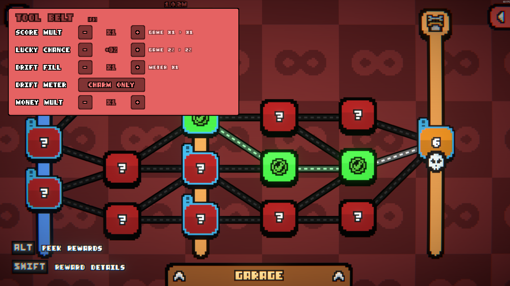

# Loopler Tool Belt

A trainer overlay for The Loopler (BepInEx 6, IL2CPP). Press **F1** in-game to open it.



Every tool scales the game's own value, so your parts, charms, gates and garage upgrades still count
underneath. Each row shows the game's value next to the result ("game 533 > 1066"). The **-** and
**+** buttons step through x1, 1.25, 1.5, 2, 3, 5, 10, 25, 50, 100, 250 and on up to 5e30, so the game
can get as far out of hand as you like.

**Run tab**

| Tool | What it does |
| --- | --- |
| Score mult | Multiplies the global score multiplier (parts, gates, drift meter level). |
| Lucky chance | Adds percentage points to your lucky chance. |
| Drift fill | Multiplies how fast drift ticks fill the drift meter. |
| Drift meter | **Charm only** leaves the drift meter to its charm; **Forced on** activates it without the charm. |
| Money mult | Multiplies every gold gain: round end bonus, gates, cards and card sales. Spending is not affected. Gold stops at 2,147,483,647, the most the game can hold. |
| Base loop score | Multiplies the points per loop. |
| Drift tick rate | Makes drift ticks come faster. |
| Garage discount | Adds percentage points to the garage upgrade discount, up to 100% (free). |

**Car tab**

| Tool | What it does |
| --- | --- |
| Top speed, Acceleration, Drift grip | Multiply the car's stat. |
| Fuel capacity, Fuel economy, Refuel efficiency | Multiply the fuel stats. Higher fuel economy means less fuel used. |
| Boost gain, Boost cap, Overdrive boost | Multiply the boost stats. |
| Max durability | Adds durability, up to +1,000,000. |

**Reset all** puts every tool back to neutral (x1, +0, Charm only), which is how to play normally.
Settings are kept between sessions in `<game>\BepInEx\config\renokk.loopler.toolbelt.cfg`. The mod
writes nothing to save files itself, but the game saves whatever happens in a run, including gold
earned with a multiplier.

## Leaderboards

While the tool belt is installed, **nothing is uploaded to the game's leaderboards**, whatever the
settings are, so runs played with it can't end up on the boards. Viewing the leaderboards still
works. To compete again, remove `BepInEx\plugins\LooplerToolBelt\`.

## Install

1. Install [BepInEx 6 (IL2CPP, x64)](https://builds.bepinex.dev/projects/bepinex_be) into the game folder and start the game once.
2. Download the zip from the [latest release](https://github.com/HiveSolution/loopler-tool-belt/releases/latest) and extract it into the game folder, so that `LooplerToolBelt.dll` ends up in `<game>\BepInEx\plugins\LooplerToolBelt\`.

Tested with BepInEx 6.0.0-be.788 on The Loopler built with Unity 6000.3.16f1.

## Build

Needs the .NET SDK (6 or newer) and a game install with BepInEx that has been started once, because
the build references the generated assemblies in `BepInEx\interop`. They are regenerated after every
game update; rebuild after that.

```
dotnet build -c Release -p:Deploy=true
```

`Deploy=true` copies the DLL into the game (close the game first, it locks the file). The game folder
defaults to the path in `LooplerToolBelt.csproj`; override it with `-p:GameDir="..."` or the
`LOOPLER_GAME_DIR` environment variable.

## Layout

- `src/Plugin.cs`: BepInEx entry point and config entries.
- `src/Stats.cs`: the car and run stats (per game `StatType`), the -/+ step ladder and number formatting.
- `src/Patches.cs`: the hooks into the game's score multiplier, luck, stats, drift meter and gold.
- `src/LeaderboardBlock.cs`: blocks every leaderboard upload.
- `src/TrainerUI.cs`: F1 key and the overlay, built from the game's own font, sprites and colours.

## License

Copyright (c) 2026 [RenokK/HiveSolution](https://github.com/HiveSolution). Licensed under
[CC BY-NC 4.0](LICENSE.txt): source available, not open source. You may share and modify it for
noncommercial purposes with attribution; commercial use, including reselling or bundling it into
commercial products, is not permitted.
